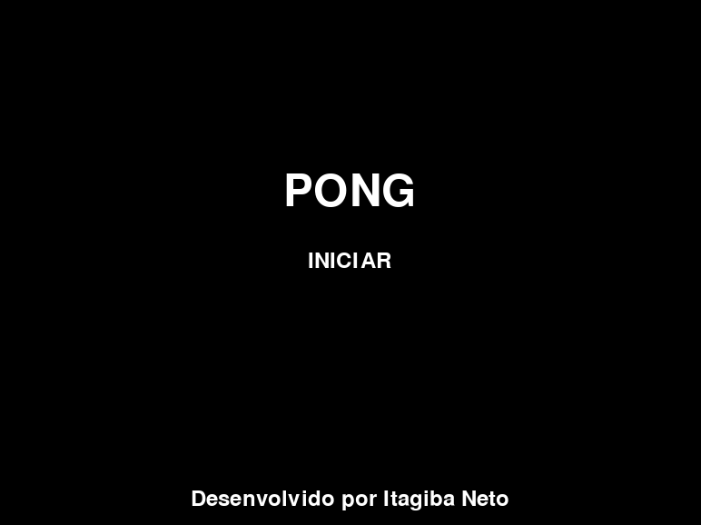
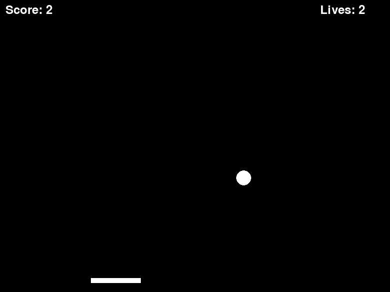
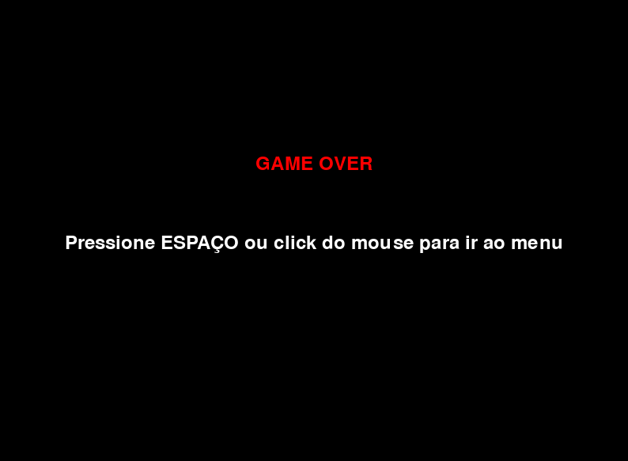

# Pong-Pygame

Este é um projeto simples do jogo **Pong**, desenvolvido utilizando a biblioteca **Pygame**. 

O jogo Pong é considerado um marco da primeira geração de videogames. Ele surgiu e ficou famoso na década de 1970, mais precisamente em 1972.
Foi um dos primeiros jogos eletrônicos de sucesso comercial e teve um papel fundamental na popularização dos videogames.
O objetivo do jogo é controlar uma plataforma (paddle) e impedir que a bola ultrapasse o limite inferior da tela. 
Nessa versão que criei, a cada vez que a bola colidir com a plataforma, a velocidade aumenta, tornando o jogo mais desafiador.

## Funcionalidades

- Controle do paddle usando o mouse.
- A bola acelera a cada colisão com o paddle, aumentando o desafio.
- Sistema de vidas: o jogador perde uma vida quando a bola ultrapassa o paddle.
- Placar que exibe a pontuação atual e as vidas restantes.
- Tela de início com o botão "INICIAR" para começar o jogo.
- Tela de Game Over com a opção de reiniciar o jogo.
- Menu de pausa automático ao perder uma vida, permitindo reposicionar a bola sem perder o incremento de velocidade.

## Requisitos

Para executar o jogo, é necessário ter o **Python** e a biblioteca **Pygame** instalados.

### Instalação do Python

Se você ainda não tem o Python instalado, você pode baixá-lo [aqui](https://www.python.org/downloads/).

### Instalação da biblioteca Pygame

Após instalar o Python, instale a biblioteca Pygame usando o seguinte comando no terminal:

pip install pygame

### Execução do jogo

Baixe e execute o arquivo pong.exe 

(esse arquivo .exe foi gerado através do pyinstaller)

Em caso de incompatibilidade (ou se for executar em outros sistemas operacionais que não sejam windows), você deve, após baixar todos os arquivos ou clonar o repositório, acessar o diretório onde o projeto foi salvo através do terminal: cd Pygame_PONG

Execute o arquivo pong.py com: python pong.py

O jogo será iniciado e você verá a tela de menu. Clique no botão "INICIAR" ou pressione a tecla Espaço para começar a jogar.

### Controles

- Mouse: Mover o paddle (barra) horizontalmente.
- Espaço: Começar o jogo ou reiniciar após o Game Over.
- Botão esquerdo do mouse: Também pode ser usado para iniciar o jogo no menu.

### Licença
Este projeto é distribuído sob a licença MIT. Você pode usá-lo, modificá-lo e distribuí-lo livremente, desde que mantenha os créditos ao autor original.

### Screenshots

### Desenvolvedor
Desenvolvido por Itagiba Neto